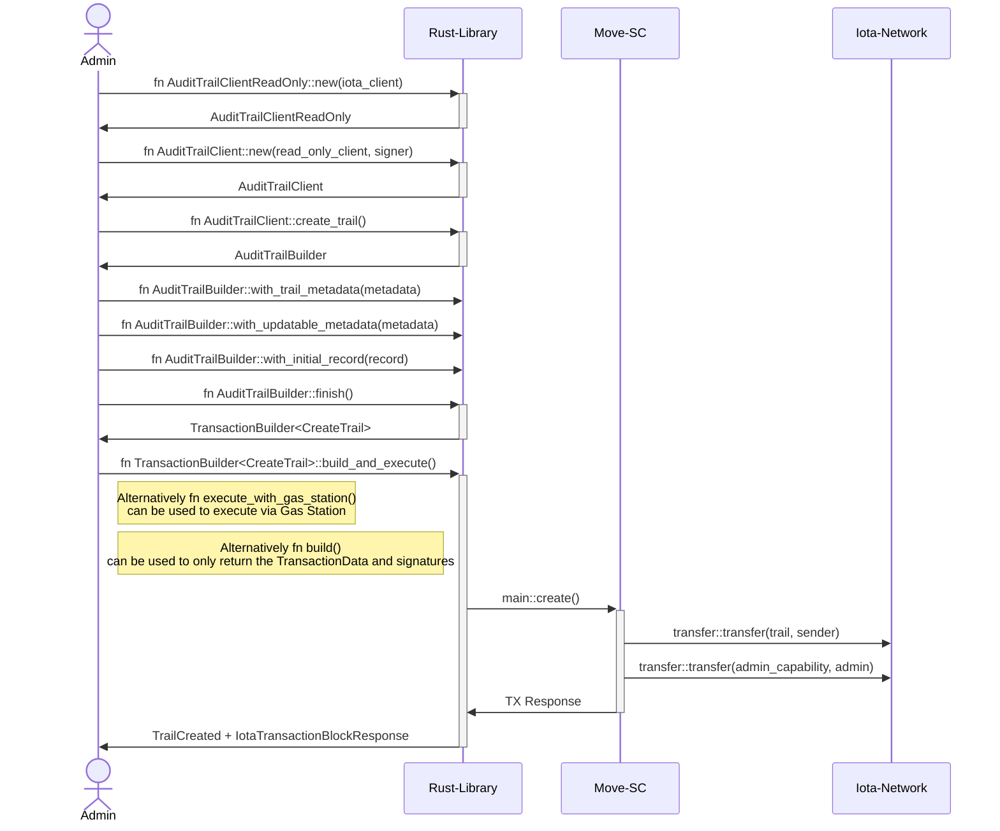
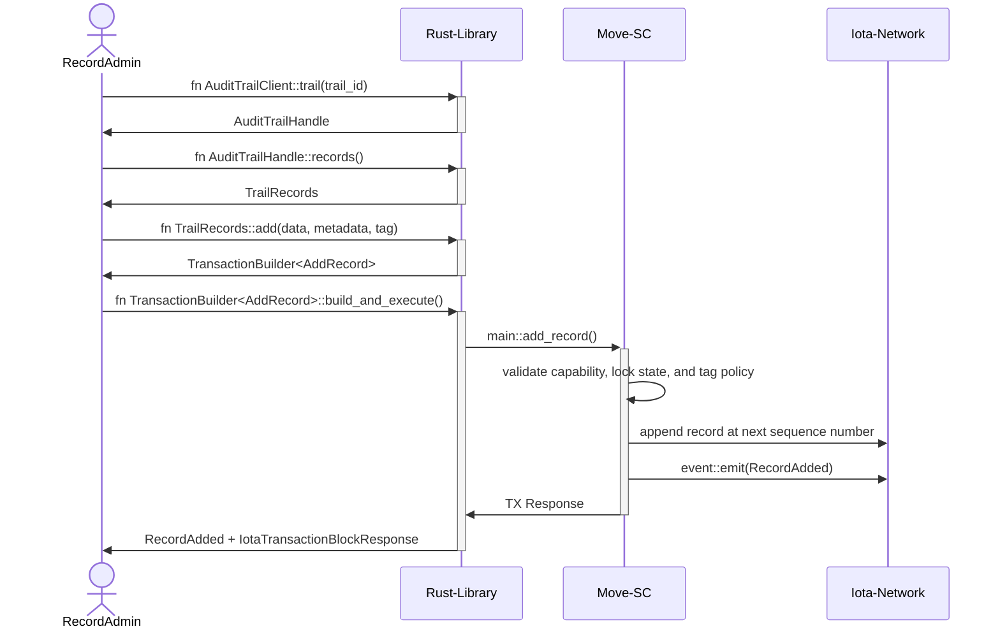
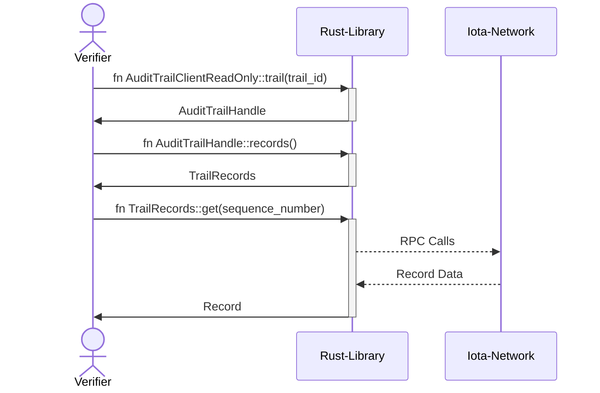
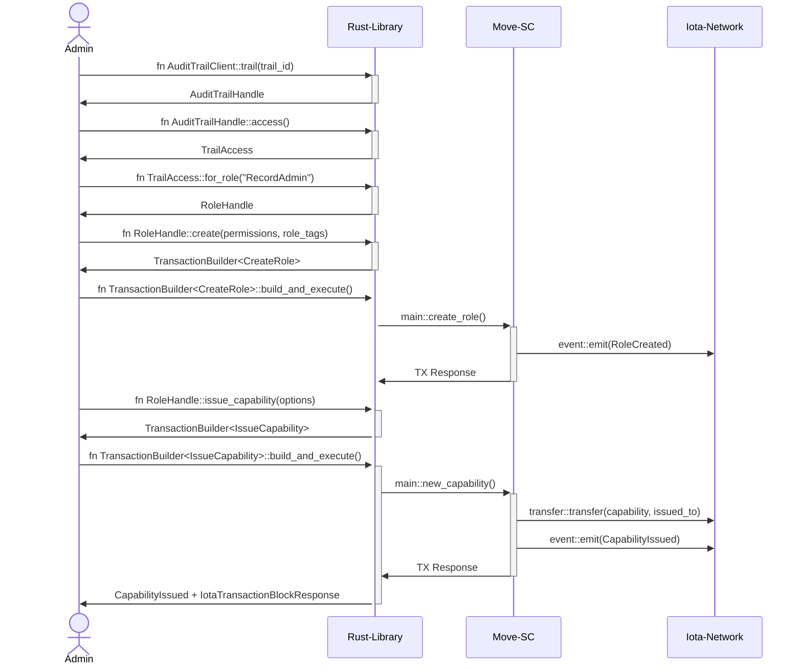
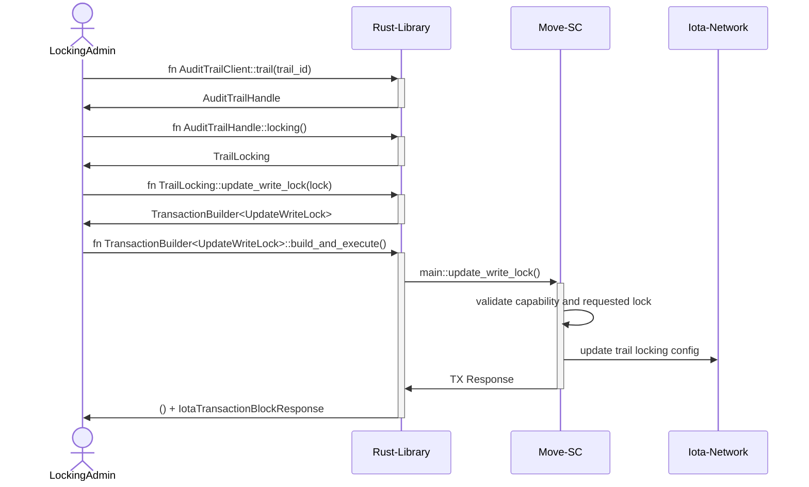

# IOTA Audit Trails Rust SDK

## Introduction

The Audit Trails Rust SDK is the Rust client for structured record histories in the IOTA Notarization Suite.

The SDK provides an `AuditTrailBuilder` that creates audit trail objects on the IOTA ledger and an `AuditTrailHandle`
that interacts with existing trails. The handle maps to one on-chain audit trail and provides typed APIs for records,
access control, locking, tags, metadata, migration, and deletion.

Use Audit Trails when you need a governed record history with sequential entries, role-based permissions, capabilities,
locking, and tagging. Use Single Notarization when you need one locked or dynamic notarized object for arbitrary data,
documents, hashes, or latest-state records.

You can find the full IOTA Notarization Suite documentation [here](https://docs.iota.org/developer/iota-notarization).

## Process Flows

The following workflows demonstrate how `AuditTrailBuilder` and `AuditTrailHandle` instances create, update, govern, and
delete audit trail objects on the ledger.

### Creating an Audit Trail

An _Audit Trail_ is created on the ledger using the `AuditTrailClient::create_trail()` function. To create an _Audit
Trail_, specify the following initial arguments with the `AuditTrailBuilder` setter functions. The terms used here are
defined in the [glossary below](#glossary).

- Optional `Initial Record` that becomes sequence number `0`
- Optional `Immutable Metadata`
- Optional `Updatable Metadata`
- Optional `Locking Config`
- Optional `Record Tag Registry`
- Optional initial admin address

After an _Audit Trail_ has been created, the creator receives an Admin capability object. This capability authorizes
administrative operations such as defining roles, issuing capabilities, updating locks, managing tags, and deleting the
trail.

#### Creating a new Audit Trail on the Ledger

The following sequence diagram explains the interaction between the involved technical components and the `Admin` when an
_Audit Trail_ is created on the ledger:

### Adding And Reading Records

Records are managed through the trail-scoped record API returned by `AuditTrailHandle::records()`. A record append uses
`TrailRecords::add()`, while read paths use `TrailRecords::get()`, `TrailRecords::record_count()`, `TrailRecords::list()`,
or `TrailRecords::list_page()`.

To add a record, the sender must hold a capability whose role allows record writes. Tagged records must use a tag already
defined in the trail's tag registry, and the sender's role must allow that tag.

#### Appending a Record to an Existing Audit Trail

The following sequence diagram shows the component interaction when a `Record Admin` appends a new record:

#### Reading Records from an Existing Audit Trail

The following sequence diagram explains the component interaction for `Verifiers` or other parties fetching trail
records:

### Managing Access

Access control is managed through the trail-scoped access API returned by `AuditTrailHandle::access()`. Roles define
which permissions are allowed, and capability objects delegate those roles to users or services.

The built-in Admin role is initialized when the trail is created. Additional roles can be created with
`TrailAccess::for_role(name).create(...)`, updated with `update_permissions(...)`, and delegated with
`issue_capability(...)`. Issued capabilities can also be revoked, destroyed, or constrained by address and validity
window.

#### Defining a Role and Issuing a Capability

The following sequence diagram shows the component interaction when an `Admin` defines a role and issues a capability:

### Locking And Deletion

Locking is managed through the trail-scoped locking API returned by `AuditTrailHandle::locking()`. The lock configuration
controls three independent behaviors:

- when records can be deleted
- when the entire trail can be deleted
- when new records can be written

An audit trail can be deleted only after its records are removed and the delete-trail lock allows deletion. Records can
be deleted individually with `TrailRecords::delete()` or in batches with `TrailRecords::delete_records_batch()`.

#### Updating Locking Rules

The following sequence diagram shows the component interaction when a `Locking Admin` updates the write lock:

#### Deleting an Audit Trail

The lifecycle of an _Audit Trail_ deletion can be described as:

- Delete all eligible unlocked records with `TrailRecords::delete()` or `TrailRecords::delete_records_batch()`
- Wait until the `Delete Trail Lock` allows trail deletion, if a lock is configured
- Delete the trail object with `AuditTrailHandle::delete_audit_trail()`

The trail deletion process does not remove records automatically. The trail must be empty before
`delete_audit_trail()` can succeed.

## Glossary

- `Audit Trail`: A shared on-chain object that stores ordered records, metadata, locking configuration, tag registry,
  roles, and capability state.
- `Record`: A single trail entry stored at a sequence number. Records contain `Data`, optional record metadata, an
  optional tag, and creation information.
- `Initial Record`: An optional record created together with the trail. When present, it is stored at sequence number
  `0`.
- `Sequence Number`: The numeric position of a record inside a trail. Sequence numbers are used to fetch, delete, and
  reason about records.
- `Admin Capability`: The capability object created at trail creation time. It authorizes administrative operations for
  the trail.
- `Role`: A named permission set stored inside the trail. Roles define which operations a capability holder may perform.
- `Permission Set`: A collection of permissions such as adding records, deleting records, updating locks, managing tags,
  managing metadata, or managing capabilities.
- `Capability`: An owned object that grants one role for one audit trail. Capabilities can optionally be restricted to an
  address or a validity window.
- `Record Tag Registry`: The trail-owned list of tags that records may use. Tagged writes must reference a registered
  tag.
- `Role Tags`: Optional role-scoped tag restrictions. They narrow which tagged records a role may operate on.
- `Locking Config`: The active locking rules for record deletion, trail deletion, and record writes.
- `Delete Record Window`: A locking rule that controls when individual records can be deleted.
- `Delete Trail Lock`: A time lock that controls when the entire trail can be deleted.
- `Write Lock`: A time lock that controls when new records can be added.
- `Immutable Metadata`: Optional metadata stored at creation time and never updated after the trail is created.
- `Updatable Metadata`: Optional metadata stored on the trail that can be replaced or cleared after creation.
- `Trail Handle`: The typed Rust handle returned by `AuditTrailClient::trail(trail_id)`. It scopes record, access,
  locking, tag, metadata, migration, and deletion operations to one audit trail.

## Documentation And Resources

- [Audit Trails Move Package](https://github.com/iotaledger/notarization/tree/main/audit-trail-move): On-chain contract package that defines the shared object model, permissions, locking, and events.
- [Audit Trails Wasm SDK](https://github.com/iotaledger/notarization/tree/main/bindings/wasm/audit_trail_wasm): JavaScript and TypeScript bindings for browser and Node.js integrations.
- [Audit Trails Wasm Examples](https://github.com/iotaledger/notarization/tree/main/bindings/wasm/audit_trail_wasm/examples/README.md): Runnable audit-trail examples for JS and TS consumers.
- [Repository Examples](https://github.com/iotaledger/notarization/tree/main/examples/README.md): End-to-end examples across the Notarization Suite.

This README is also used as the crate-level rustdoc entry point, while the source files provide detailed API documentation for all public types and methods.

## Bindings

[Foreign Function Interface (FFI)](https://en.wikipedia.org/wiki/Foreign_function_interface) bindings of this Rust SDK to other programming languages:

- [Web Assembly](https://github.com/iotaledger/notarization/tree/main/bindings/wasm/audit_trail_wasm) (JavaScript/TypeScript)

## Contributing

We would love to have you help us with the development of the IOTA Notarization Suite. Each and every contribution is greatly valued.

Please review the [contribution](https://docs.iota.org/developer/iota-notarization/contribute) sections in the [IOTA Docs Portal](https://docs.iota.org/developer/iota-notarization/).

To contribute directly to the repository, simply fork the project, push your changes to your fork and create a pull request to get them included.

The best place to get involved in discussions about this library or to look for support at is the `#notarization` channel on the [IOTA Discord](https://discord.gg/iota-builders). You can also ask questions on our [Stack Exchange](https://iota.stackexchange.com/).
