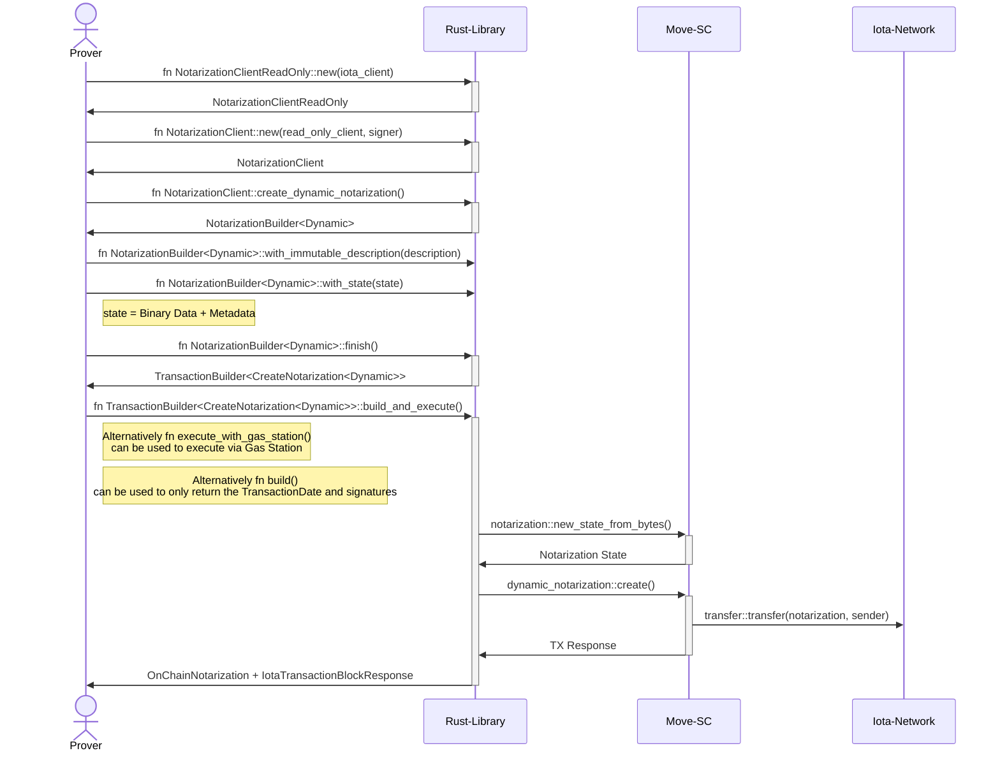
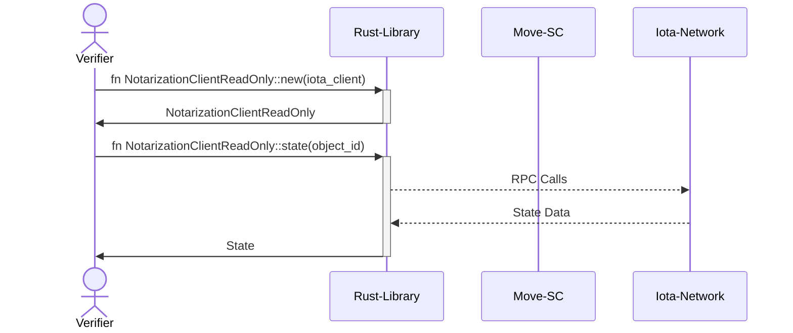
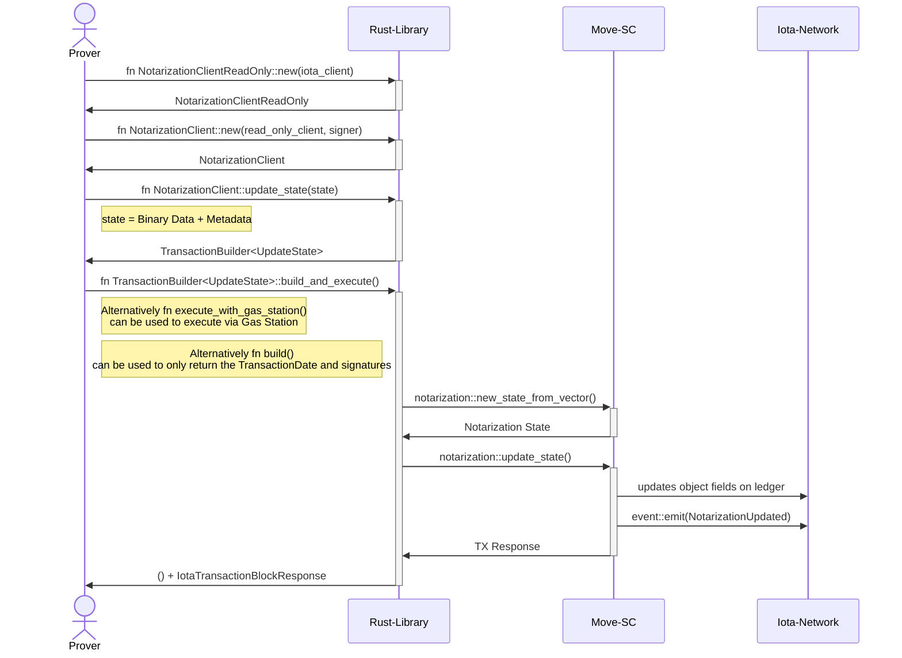

# IOTA Single Notarization

The Single Notarization Rust SDK is the Rust client for individual locked and dynamic notarizations in the IOTA
Notarization Suite.

The SDK provides a `NotarizationBuilder` that creates notarization objects on the IOTA ledger or connects to existing
notarization objects. The builder returns a `Notarization` struct instance that maps to the on-chain object and provides
typed methods for interacting with it.

Use Single Notarization when you need one notarized object for arbitrary data, documents, hashes, or latest-state
records. Use Audit Trails when you need a structured record history with roles, capabilities, locking, and tagging.

You can find the full IOTA Notarization Suite documentation [here](https://docs.iota.org/developer/iota-notarization).

## Process Flows

The following workflows demonstrate how `NotarizationBuilder` and `Notarization` instances create, update, and destroy
single notarization objects on the ledger.

### Dynamic Notarizations

A _Dynamic Notarization_ is created on the ledger using the `NotarizationBuilder::create_dynamic()` function.
To create a _Dynamic Notarization_, specify the following initial arguments with the `NotarizationBuilder` setter
functions. The terms used here are defined in the [glossary below](#glossary).

- Initial State consisting of `Stored Data` and `State Metadata` that will be used to define the first version of the
  Notarization state.
- Optional `Immutable Description`
- Optional `Updatable Metadata` (**Dynamic**: always updatable; **Locked**: immutable)
- An optional boolean indicator if the Notarization shall be transferable

After a **dynamic** Notarization has been created, it can be updated using the `Notarization::update_state()` function
and destroyed using `Notarization::destroy()`.
**Locked** notarizations are immutable after creation.

#### Creating a new Dynamic Notarization on the Ledger

The following sequence diagram explains the interaction between the involved technical components and the `Prover` when a
_Dynamic Notarization_ is created on the ledger:

#### Fetching state data from an existing Notarization on the ledger

The following sequence diagram explains the component interaction for `Verifiers` (or other parties) fetching the
`Latest State`:

#### Updating state data of an existing Notarization on the ledger

The following sequence diagram shows the component interaction in case a `Prover` wants to update the `Latest State` of a
Notarization:

### Locked Notarizations

In general, _Locked Notarizations_ are handled similarly to _Dynamic Notarizations_. A `NotarizationBuilder` for a
_Locked Notarization_ is created using the `NotarizationClient::create_locked_notarization()` function. The resulting
`NotarizationBuilder<Locked>` can be used to create the _Locked Notarization_ on the ledger using the
`NotarizationBuilder<Locked>::finish()` function.

To create a _Locked Notarization_, specify the following arguments with the `NotarizationBuilder<Locked>` setter
functions:

- all arguments needed to create a _Dynamic Notarization_
- Optional Delete Timelock

After the _Locked Notarization_ has been created, the `Latest State` cannot be updated by design.

The lifecycle of a _Locked Notarization_ can be described as:

- Create a Notarization object using the functions `NotarizationClient::create_locked_notarization()` and `NotarizationBuilder<Locked>::finish()`
- If a `Delete Timelock` has been used, wait at least until the time-lock has expired
- Destroy the Notarization object

As the `Latest State` of a _Locked Notarization_ cannot be updated, the lifecycle does not include any update processes.

## Glossary

- `Original Data`: The document, file, or arbitrary data that is intended to be notarized. In _Dynamic Notarization_,
  typically only a representation (e.g., a hash or JSON) of this data is stored on-chain.
- `Stored Data`: The exact bytes currently held in the updatable ledger object. This represents the latest state of the
  data; each update completely overwrites the previous stored data.
- `Ledger Object`: A single, updatable on-chain object that holds the `Latest State` of the notarized data. It is
  identified by a unique ObjectId and is modified through update transactions.
- `Transfer Timelock`: An optional time-locking period during which the `Ledger Object` cannot be transferred.
- `Delete Timelock`: An optional time-locking period during which the `Ledger Object` cannot be deleted.
- `State Metadata`: An optional text describing the `Stored Data`. For example, if document hashes of succeeding
  revisions of a document are stored as `Stored Data`, State Metadata can be used to describe the revision specifier of
  the document.
- `Latest State`: The most recent version of the `Stored Data` (and optionally the `State Metadata`) within the
  `Ledger Object`. In _Dynamic Notarization_, only this latest state is visible on-chain, as previous states are
  overwritten. As the `Stored Data` and optionally the `State Metadata` together build the `Latest State` they can only
  be updated together in one function call.
- `Storage Deposit`: IOTA tokens locked alongside the ledger object to secure its permanence on-chain. This deposit
  typically remains constant, unless the object's data size increases significantly.
- `Data Availability`: In _Dynamic Notarization_, the ledger exclusively retains the `Latest State` of the data. Older
  states are overwritten and thus are not available on-chain, ensuring that `Verifiers` always see only the latest
  version.
- `Prover`: The entity responsible for initiating update transactions to modify the `Ledger Object` with the
  `Latest State`.
- `Verifier`: The entity that retrieves and checks the `Latest State` from the `Ledger Object` to confirm the data’s
  immutability.
- `Immutable Description`: An arbitrary informational String that can be used for example to describe the purpose of the
  created _Dynamic Notarization_ object, how often it will be updated or other legally important or useful information.
  The `Immutable Description` is specified by the `Prover` at creation time and cannot be updated after the Notarization
  object has been created.
- `Creation Timestamp`: Indicates when the `Ledger Object` was initially created.
- `Immutable Metadata`: Consists of the `Immutable Description` and `Creation Timestamp`.
- `Updatable Metadata`: An arbitrary informational String that can be updated at any time by the `Prover` independently
  from the `Latest State` (dynamic notarizations only; locked notarizations are immutable). Can be used to provide
  additional useful information that is subject to change from time to time.
- `State Version Count`: Numerical value incremented with each update of the `Latest State`.
- `Last State Change Time`: Indicates when the `Latest State` was last updated.
- `Calculated Metadata`: Consists of the `State Version Count` and `Last State Change Time`
- `Notarized Record`: Some information owned by the `Prover` that describes and includes notarized data, so that this data
  can be verified by a `Verifier`. In the context of the _Dynamic Notarization_ method, the latest version of subsequent
  versions of a `Notarized Record` is the `Latest State`.
