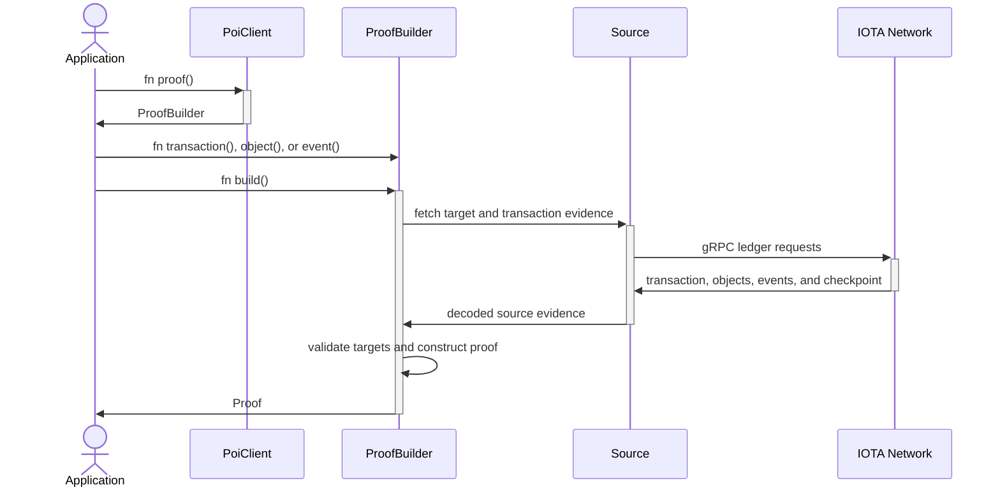
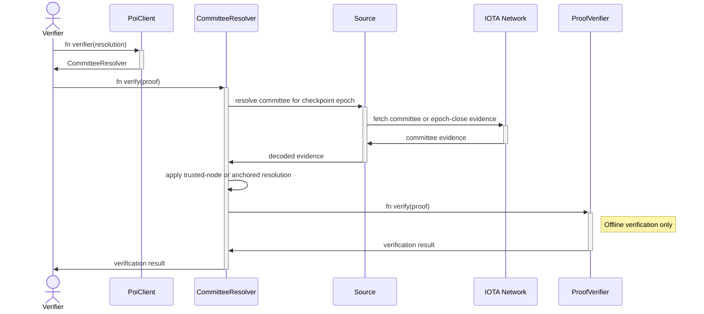

# IOTA Proof of Inclusion Rust Package

## Introduction

The Proof of Inclusion Rust Package constructs and verifies portable evidence that IOTA ledger data is included in a
certified checkpoint. It is the Rust Package for Proof of Inclusion in the IOTA Notarization Toolkit.

Use Proof of Inclusion when a verifier needs cryptographic evidence for a transaction, event, or object state without
trusting the source that transports the proof. `PoiClient` provides the main entry point, `ProofBuilder` constructs the
evidence, and `ProofVerifier` verifies it locally against a committee the caller trusts.

Proof of Inclusion operates on existing IOTA ledger activity. It does not define a separate on-chain object or Move
Package. Single Notarization and Audit Trails can create ledger activity that applications later prove, but Proof of
Inclusion also supports transactions, events, and object states created by other IOTA applications.

You can find the full IOTA Notarization Toolkit documentation [here](https://docs.iota.org/developer/iota-notarization).

## Process Flows

Proof construction and verification are separate workflows with different trust responsibilities. Proof construction
collects evidence from a ledger source, while verification authenticates that evidence relative to a committee trust
decision made by the caller.

### Constructing a Proof

The following sequence shows how `PoiClient` and `ProofBuilder` construct one proof for one or more targets. Every target
must belong to the same transaction.



`Source` is the transport boundary. It fetches decoded transaction, object, checkpoint, chain, and committee evidence.
`ProofBuilder` owns target resolution, consistency checks, duplicate suppression, and proof construction, so custom
sources do not reimplement that workflow.

### Verifying a Proof

The following sequence shows committee-aware verification through `PoiClient::verifier()`. Committee resolution may
fetch evidence, but `ProofVerifier` performs the final proof checks locally without making network requests.



`CommitteeResolution::TrustedNode` accepts committee data from a node already inside the caller's trust boundary.
Anchored resolution starts from a trusted committee or genesis blob and authenticates every committee transition before
accepting the committee required by the proof.

## Proof Construction

`PoiClient` provides explicit constructors for the public IOTA networks. The client does not select a default network,
so the calling application always chooses where it fetches proof material.

```rust,no_run
use iota_sdk_types::TransactionDigest;
use poi_rs::PoiClient;

# async fn example() -> Result<(), Box<dyn std::error::Error>> {
let transaction_digest: TransactionDigest = todo!();
let client = PoiClient::mainnet()?;
let proof = client
    .proof()
    .transaction(transaction_digest)
    .build()
    .await?;
# Ok(())
# }
```

Use `PoiClient::testnet()` or `PoiClient::devnet()` for the other public networks. Applications can pass a custom `Source`
to `PoiClient::new(source)` when they use a private node, archive, fixture, or local test cluster. `ProofBuilder` remains
available directly for lower-level use.

A builder can stack multiple object and event targets by calling `object()` and `event()` repeatedly or by using the
`objects()` and `events()` batch methods. Every target must belong to the same transaction. The builder ignores exact
duplicates and reuses one transaction and one checkpoint for the complete target set.

Network selection configures only the proof source. It does not make the returned proof trusted or select an
authoritative committee for verification.

The default `native-grpc` feature implements `Source` directly for the SDK `GrpcClient` and provides the public-network
constructors. WASM packages can disable default features and supply a JavaScript-backed `Source` without compiling
native gRPC.

## Verification

Create a verifier from the same `PoiClient` for the common source-backed workflow. The verifier resolves the committee
required by the proof and then performs offline proof verification.

```rust,no_run
use std::fs::File;

use poi_rs::{CommitteeResolution, PoiClient, Proof};

# async fn example(proof: &Proof) -> Result<(), Box<dyn std::error::Error>> {
let client = PoiClient::testnet()?;
let resolution = CommitteeResolution::from_genesis(File::open("genesis.blob")?)?;
let verifier = client.verifier(resolution);

let verified = verifier.verify(proof).await?;
println!("verified transaction: {}", verified.transaction_digest());
# Ok(())
# }
```

`CommitteeResolution::TrustedNode` is available when the connected node is explicitly inside the caller's trust
boundary. `CommitteeResolution::from_genesis()` loads an anchor committee from a trusted BCS-encoded genesis blob,
while `CommitteeResolution::anchored()` accepts an already extracted trusted committee. Use
`CommitteeResolution::anchored_with_cache()` or `CommitteeResolution::from_genesis_with_cache()` to supply a cache that
persists authenticated committees. Shared cache entries are keyed by both the trusted genesis checkpoint digest and
epoch, so one backend can be shared safely by resolvers for different networks. The genesis-based constructor derives
the chain identifier automatically; `anchored_with_cache()` requires it explicitly.

Retain the verifier when checking multiple proofs so it can reuse its authenticated committee cache. `ProofVerifier`
remains the offline entry point for callers that already possess the authoritative committee.

Successful verification returns a `VerifiedProof` that borrows from the input proof and exposes only authenticated
checkpoint metadata, transaction data and digest, object targets, and event claims. It intentionally omits the packaged
user signatures because checkpoint inclusion does not authenticate those bytes. Read relying-party data through this
returned value. The original `Proof` remains the portable untrusted envelope used for transport and serialization.

Verification checks:

- the checkpoint summary is certified by the supplied committee;
- the checkpoint contents match the certified checkpoint summary;
- the transaction digest matches the transaction effects;
- the transaction effects are included in the checkpoint contents;
- a transaction target declared by the proof matches the packaged transaction;
- object targets declared by the proof derive references present in the transaction effects;
- event data matches the digest recorded in the effects when the proof includes event targets; and
- event targets declared by the proof belong to the transaction and select events in the authenticated event list.

## Proof Model

A `Proof` contains three layers of evidence:

- `ProofTargets` records the transaction, objects, and events explicitly selected by the caller.
- A `CertifiedCheckpointSummary` and its `CheckpointContents` link the transaction to a committee-certified checkpoint.
- A required `TransactionProof` contains the transaction, its effects, and event data when event targets are present.

Object targets contain their exact object values. Verification derives each object reference and finds it in the
transaction effects. Event targets contain `EventID` values, while the transaction proof carries the complete event list
needed to verify the effects' event digest. A transaction target is present only when the caller explicitly requests the
transaction itself, although transaction evidence supports every proof.

## Trust Boundaries

`ProofVerifier` is intentionally offline. It does not make RPC calls and does not decide which committee is
authoritative. `CommitteeResolver::verify()` composes committee resolution with offline verification for source-backed
workflows, while `CommitteeResolver::resolve()` returns the authenticated committee when callers need it directly.

Treat every proof payload as untrusted. After successful verification, trust claims relative to the supplied committee
through the returned `VerifiedProof`; do not read relying-party claims from an unrelated `Proof` value.

The proof's `chain` value is informational. The verifier does not authenticate it, so applications must not use it to
select a network, committee, genesis blob, or other trust anchor.

## Command-Line Interface

The optional `cli` feature builds the `poi` command for creating and verifying JSON proofs. CLI verification uses a
trusted genesis blob and does not provide trusted-node verification.

### Building the CLI From Source

The project does not distribute pre-built `poi` binaries. Build the CLI locally from the repository source with Rust
1.85 or later:

```bash
git clone https://github.com/iotaledger/notarization.git
cd notarization
cargo build --release -p poi-rs --features cli --bin poi
```

Cargo writes the binary to `target/release/poi` on Linux and macOS or `target\release\poi.exe` on Windows. Run the
locally built binary from the repository root:

```bash
./target/release/poi --help
```

You can also build from source and install `poi` into Cargo's binary directory:

```bash
cargo install --path poi-rs --features cli --bin poi --locked
```

### Using the CLI

```bash
cargo run --release -p poi-rs --features cli --bin poi -- create \
  --network testnet \
  --transaction <transaction-digest> \
  --output proof.json

cargo run --release -p poi-rs --features cli --bin poi -- verify \
  --network testnet \
  proof.json
```

Run `cargo run --release -p poi-rs --features cli --bin poi -- --help` for all targets, network options, and file input
formats.

## Glossary

- `Proof`: Versioned Proof of Inclusion envelope.
- `ProofV1`: Version 1 checkpoint and transaction evidence carried by `Proof::ProofV1`.
- `TransactionProof`: Transaction, effects, and optional event evidence used to prove inclusion.
- `ProofTargets`: Transaction, object, and event claims explicitly selected by the caller.
- `PoiClient`: Source-backed entry point for proof construction and committee-aware verification.
- `CommitteeResolution`: Trusted-node or anchored committee-resolution configuration, including the committee cache.
- `ProofBuilder`: Proof-construction workflow for public networks or custom sources.
- `Source`: Ledger-read boundary for gRPC nodes, JavaScript clients, archives, fixtures, and other evidence sources.
- `SourceTransaction` and `SourceCheckpoint`: Transport-independent decoded evidence returned by a `Source`.
- `CommitteeResolver`: Committee resolution and source-backed verification configured by `CommitteeResolution`.
- `ProofVerifier`: Offline verifier for `Proof` values.
- `SourceError`: Transport and response failure from a ledger source.
- `ProofBuilderError`, `CommitteeResolutionError`, `ProofVerificationError`, `VerifyError`, and `SerializationError`:
  Operation-specific errors.

## Documentation And Resources

- [Proof of Inclusion Rust API documentation](https://iotaledger.github.io/notarization/poi_rs/index.html)
- [Proof of Inclusion Rust Examples](https://github.com/iotaledger/notarization/tree/main/examples/poi/README.md)
- [Proof of Inclusion Wasm Package](https://github.com/iotaledger/notarization/tree/main/bindings/wasm/poi_wasm/README.md)
- [Proof of Inclusion Wasm Examples](https://github.com/iotaledger/notarization/tree/main/bindings/wasm/poi_wasm/examples/README.md)
- [Repository Root](https://github.com/iotaledger/notarization/tree/main/README.md)

This README is also the crate-level rustdoc entry point. Source files provide detailed API documentation for all public
types and methods.

## Bindings

The [Proof of Inclusion Wasm Package](https://github.com/iotaledger/notarization/tree/main/bindings/wasm/poi_wasm)
provides JavaScript and TypeScript bindings for Node.js applications.

## Contributing

We would love to have you help us develop the IOTA Notarization Toolkit. Every contribution is greatly valued.

Review the [contribution](https://docs.iota.org/developer/iota-notarization/contribute) sections in the
[IOTA Docs Portal](https://docs.iota.org/developer/iota-notarization/).

To contribute directly to the repository, fork the project, push your changes to your fork, and create a pull request.

Join the `#notarization` channel on the [IOTA Discord](https://discord.gg/iota-builders) for development discussions and
support. You can also ask questions on [IOTA Stack Exchange](https://iota.stackexchange.com/).
